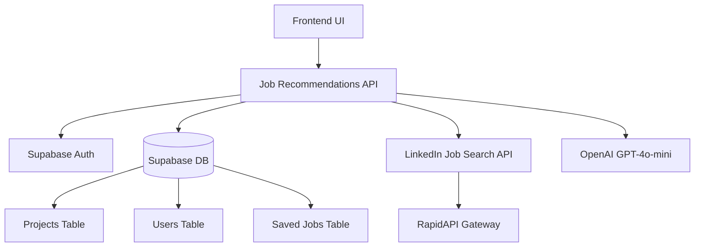

# Design Document

## Overview

This feature integrates the LinkedIn Job Search API from RapidAPI to provide personalized job recommendations based on user portfolios. The system will analyze user projects to extract tech stacks, combine this with their target role preference, query the LinkedIn API for relevant jobs, calculate match scores using AI, and present ranked recommendations with detailed explanations.

The LinkedIn Job Search API indexes over 20,000 jobs hourly and maintains a database of jobs from the last 7 days (2+ million jobs weekly). Each API call returns up to 100 jobs with comprehensive details including job descriptions, company information, location, and application URLs.

## Architecture

### High-Level Flow

1. User requests job recommendations from dashboard or dedicated page
2. System retrieves user profile (target role) and projects from database
3. Tech stack is extracted from projects (languages, frameworks, technologies)
4. LinkedIn Job Search API is queried with role and tech stack parameters
5. OpenAI analyzes each job against user profile to calculate match scores
6. Results are ranked by match score and returned to frontend
7. User can filter, save, and view detailed match explanations

### Component Diagram



## Components and Interfaces

### 1. RapidAPI Client (`lib/linkedin/client.ts`)

HTTP client for communicating with the LinkedIn Job Search API via RapidAPI.

```typescript
interface LinkedInJobSearchParams {
  keywords?: string;
  location?: string;
  datePosted?: "24hr" | "week" | "month";
  jobType?: "full-time" | "part-time" | "contract" | "internship";
  remoteFilter?: "remote" | "on-site" | "hybrid";
  experienceLevel?:
    | "entry"
    | "associate"
    | "mid-senior"
    | "director"
    | "executive";
  limit?: number; // max 100
}

interface LinkedInJob {
  id: string;
  title: string;
  company: string;
  companyId?: string;
  location: string;
  description: string;
  applyUrl: string;
  postedDate: string;
  jobType?: string;
  experienceLevel?: string;
  companyIndustry?: string;
  companyFollowers?: number;
  companySpecialties?: string[];
}

class LinkedInJobClient {
  async searchJobs(params: LinkedInJobSearchParams): Promise<LinkedInJob[]>;
  async getJobById(jobId: string): Promise<LinkedInJob>;
}
```

### 2. Job Matching Service (`lib/linkedin/matcher.ts`)

Analyzes jobs against user profiles to calculate match scores.

```typescript
interface JobMatchAnalysis {
  jobId: string;
  matchScore: number; // 0-100
  matchedSkills: string[];
  missingSkills: string[];
  matchedProjects: string[]; // Project IDs that demonstrate matched skills
  reasoning: string;
  recommendations: string[]; // Suggested projects to fill gaps
}

async function analyzeJobMatch(
  job: LinkedInJob,
  userSkills: string[],
  userProjects: ProjectRow[],
  targetRole: string
): Promise<JobMatchAnalysis>;
```

### 3. Job Recommendations API (`app/api/jobs/recommendations/route.ts`)

Main API endpoint for fetching personalized job recommendations.

**GET /api/jobs/recommendations**

Query Parameters:

- `location` (optional): Filter by location
- `remote` (optional): "remote" | "on-site" | "hybrid"
- `experienceLevel` (optional): "entry" | "associate" | "mid-senior"
- `limit` (optional): Number of results (default 10, max 50)

Response:

```typescript
{
  jobs: Array<{
    job: LinkedInJob;
    matchAnalysis: JobMatchAnalysis;
  }>;
  userSkills: string[];
  targetRole: string;
}
```

### 4. Saved Jobs API (`app/api/jobs/saved/route.ts`)

Manages user's saved job listings.

**GET /api/jobs/saved** - Retrieve all saved jobs for user

**POST /api/jobs/saved** - Save a job

```typescript
{
  jobId: string;
  jobData: LinkedInJob;
  matchScore: number;
}
```

**DELETE /api/jobs/saved/:id** - Remove a saved job

### 5. Frontend Components

**`app/job-recommendations/page.tsx`** - Main job recommendations page

- Search and filter controls
- Job listing cards with match scores
- Pagination
- Save/unsave functionality

**`components/jobs/JobCard.tsx`** - Individual job display

- Job title, company, location
- Match score visualization (progress bar/badge)
- Quick view of matched skills
- Save button
- Apply link

**`components/jobs/JobDetailModal.tsx`** - Detailed job view

- Full job description
- Matched skills breakdown
- Missing skills with project recommendations
- Company information
- Apply button

**`components/jobs/JobFilters.tsx`** - Filter controls

- Location input
- Remote preference toggle
- Experience level selector
- Clear filters button

## Data Models

### Database Schema

**saved_jobs table**

```sql
CREATE TABLE saved_jobs (
  id UUID PRIMARY KEY DEFAULT uuid_generate_v4(),
  user_id UUID NOT NULL REFERENCES users(id) ON DELETE CASCADE,
  job_id VARCHAR(255) NOT NULL,
  job_data JSONB NOT NULL, -- Stores LinkedInJob object
  match_score INTEGER,
  match_analysis JSONB, -- Stores JobMatchAnalysis object
  created_at TIMESTAMP DEFAULT NOW(),
  UNIQUE(user_id, job_id)
);

CREATE INDEX idx_saved_jobs_user_id ON saved_jobs(user_id);
CREATE INDEX idx_saved_jobs_created_at ON saved_jobs(created_at DESC);
```

### TypeScript Types

```typescript
// types/jobs.ts
export interface LinkedInJob {
  id: string;
  title: string;
  company: string;
  companyId?: string;
  location: string;
  description: string;
  applyUrl: string;
  postedDate: string;
  jobType?: string;
  experienceLevel?: string;
  companyIndustry?: string;
  companyFollowers?: number;
  companySpecialties?: string[];
}

export interface JobMatchAnalysis {
  jobId: string;
  matchScore: number;
  matchedSkills: string[];
  missingSkills: string[];
  matchedProjects: string[];
  reasoning: string;
  recommendations: string[];
}

export interface SavedJob {
  id: string;
  userId: string;
  jobId: string;
  jobData: LinkedInJob;
  matchScore?: number;
  matchAnalysis?: JobMatchAnalysis;
  createdAt: Date;
}

export interface SavedJobRow {
  id: string;
  user_id: string;
  job_id: string;
  job_data: any; // JSONB
  match_score?: number;
  match_analysis?: any; // JSONB
  created_at: string;
}
```

## Correctness Properties

_A property is a characteristic or behavior that should hold true across all valid executions of a system—essentially, a formal statement about what the system should do. Properties serve as the bridge between human-readable specifications and machine-verifiable correctness guarantees._

### Property 1: Complete tech stack extraction

_For any_ set of user projects, the extracted tech stack should contain all programming languages from the `languages` field and all items from the `tech_stack` field across all projects.
**Validates: Requirements 1.2**

### Property 2: Job recommendations sorted by match score

_For any_ list of job recommendations returned to the user, the jobs should be sorted by match score in descending order (highest match first).
**Validates: Requirements 2.3**

### Property 3: Match score reflects skill overlap

_For any_ job and user profile, the match score should increase when the user has more skills that match the job requirements, and decrease when the user has fewer matching skills.
**Validates: Requirements 2.2**

### Property 4: Matched skills are subset of both

_For any_ job match analysis, the matched skills should be a subset of both the user's tech stack and the job's required skills.
**Validates: Requirements 2.4**

### Property 5: Missing skills are in requirements but not user skills

_For any_ job match analysis, the missing skills should be present in the job requirements but not in the user's tech stack.
**Validates: Requirements 2.5**

### Property 6: Filters are applied correctly

_For any_ combination of filters (location, experience level, remote preference), all returned jobs should match all specified filter criteria.
**Validates: Requirements 3.1, 3.2, 3.3, 3.4**

### Property 7: Save then retrieve returns same job

_For any_ job that is saved by a user, retrieving the user's saved jobs should include that job with the same job ID and core details.
**Validates: Requirements 4.1, 4.2**

### Property 8: Delete removes from saved list

_For any_ saved job that is deleted, subsequent retrieval of the user's saved jobs should not include that job.
**Validates: Requirements 4.3**

### Property 9: Saved jobs ordered by recency

_For any_ list of saved jobs for a user, the jobs should be sorted by saved timestamp in descending order (most recent first).
**Validates: Requirements 4.5**

### Property 10: API retry logic executes correctly

_For any_ failed API request due to network errors, the system should retry the request exactly 2 times before returning an error.
**Validates: Requirements 5.5**

### Property 11: Job data completeness

_For any_ job returned by the system (whether from search or saved jobs), it should contain non-empty values for job title, company name, location, description, and application URL.
**Validates: Requirements 1.4, 4.4**

### Property 12: Project recommendations for skill gaps

_For any_ set of missing skills identified in a job match, the system should suggest projects from the recommendation engine that teach at least one of those missing skills.
**Validates: Requirements 7.3**

### Property 13: Matched skills traceable to projects

_For any_ matched skill in a job analysis, the system should identify at least one user project that contains that skill in its languages or tech_stack.
**Validates: Requirements 7.4**

## Error Handling

### API Error Scenarios

1. **Rate Limit Exceeded (429)**
   - Catch RapidAPI rate limit errors
   - Return user-friendly message: "Job search limit reached. Please try again in a few minutes."
   - Log error with timestamp for monitoring

2. **Invalid API Key (401/403)**
   - Catch authentication errors
   - Return: "Job search service temporarily unavailable. Please contact support."
   - Alert development team via logging

3. **Network Errors**
   - Implement exponential backoff retry (2 attempts)
   - First retry after 1 second, second after 2 seconds
   - If all retries fail, return: "Unable to connect to job search service. Please try again later."

4. **Invalid Response Data**
   - Validate API response structure
   - Filter out jobs with missing required fields
   - Log malformed responses for investigation
   - Continue with valid jobs if partial data is usable

5. **OpenAI Analysis Errors**
   - If match analysis fails for a job, assign default match score of 50
   - Log error but don't block job display
   - Show job without detailed match breakdown

### Database Error Scenarios

1. **Save Job Conflicts**
   - Handle unique constraint violations (duplicate saves)
   - Return success if job already saved
   - Update match_score if it has changed

2. **User Not Found**
   - Return 401 Unauthorized
   - Redirect to login

3. **Database Connection Errors**
   - Return 503 Service Unavailable
   - Log error for monitoring
   - Suggest user retry

## Testing Strategy

### Unit Tests

Unit tests will verify specific examples and edge cases:

1. **Tech Stack Extraction**
   - Test with projects containing only languages
   - Test with projects containing only tech_stack
   - Test with projects containing both
   - Test with empty projects array
   - Test deduplication of skills across projects

2. **API Client**
   - Test request parameter construction
   - Test response parsing
   - Test error handling for various HTTP status codes
   - Mock RapidAPI responses

3. **Match Score Calculation**
   - Test with 100% skill match
   - Test with 0% skill match
   - Test with partial matches
   - Test with empty user skills
   - Test with empty job requirements

4. **Filtering Logic**
   - Test single filter application
   - Test multiple filter combination
   - Test with no filters
   - Test filter edge cases (empty strings, null values)

5. **Saved Jobs CRUD**
   - Test save operation
   - Test retrieve operation
   - Test delete operation
   - Test duplicate save handling
   - Test pagination of saved jobs

### Property-Based Tests

Property-based tests will verify universal properties across many randomly generated inputs using **fast-check** (JavaScript/TypeScript PBT library). Each test will run a minimum of 100 iterations.

1. **Property 1: Complete tech stack extraction**
   - Generate random arrays of projects with various languages and tech_stacks
   - Extract tech stack
   - Verify all languages and tech_stack items are present in result
   - **Feature: linkedin-job-recommendations, Property 1: Complete tech stack extraction**

2. **Property 2: Job recommendations sorted by match score**
   - Generate random arrays of jobs with random match scores
   - Sort by match score
   - Verify array is in descending order
   - **Feature: linkedin-job-recommendations, Property 2: Job recommendations sorted by match score**

3. **Property 3: Match score reflects skill overlap**
   - Generate random user skills and job requirements
   - Calculate match score
   - Add more matching skills, verify score increases
   - Remove matching skills, verify score decreases
   - **Feature: linkedin-job-recommendations, Property 3: Match score reflects skill overlap**

4. **Property 4: Matched skills are subset of both**
   - Generate random user skills and job requirements
   - Calculate matched skills
   - Verify matched skills ⊆ user skills AND matched skills ⊆ job requirements
   - **Feature: linkedin-job-recommendations, Property 4: Matched skills are subset of both**

5. **Property 5: Missing skills are in requirements but not user skills**
   - Generate random user skills and job requirements
   - Calculate missing skills
   - Verify missing skills ⊆ job requirements AND missing skills ∩ user skills = ∅
   - **Feature: linkedin-job-recommendations, Property 5: Missing skills are in requirements but not user skills**

6. **Property 6: Filters are applied correctly**
   - Generate random job arrays and random filter combinations
   - Apply filters
   - Verify all returned jobs match all filter criteria
   - **Feature: linkedin-job-recommendations, Property 6: Filters are applied correctly**

7. **Property 7: Save then retrieve returns same job**
   - Generate random user ID and job data
   - Save job
   - Retrieve saved jobs
   - Verify saved job is in results with same ID and data
   - **Feature: linkedin-job-recommendations, Property 7: Save then retrieve returns same job**

8. **Property 8: Delete removes from saved list**
   - Generate random user ID and saved jobs
   - Delete one job
   - Retrieve saved jobs
   - Verify deleted job is not in results
   - **Feature: linkedin-job-recommendations, Property 8: Delete removes from saved list**

9. **Property 9: Saved jobs ordered by recency**
   - Generate random array of saved jobs with timestamps
   - Retrieve saved jobs
   - Verify array is sorted by timestamp descending
   - **Feature: linkedin-job-recommendations, Property 9: Saved jobs ordered by recency**

10. **Property 11: Job data completeness**
    - Generate random job objects
    - Validate job data
    - Verify all required fields (title, company, location, description, applyUrl) are non-empty
    - **Feature: linkedin-job-recommendations, Property 11: Job data completeness**

11. **Property 12: Project recommendations for skill gaps**
    - Generate random missing skills and project templates
    - Get project recommendations
    - Verify each recommended project teaches at least one missing skill
    - **Feature: linkedin-job-recommendations, Property 12: Project recommendations for skill gaps**

12. **Property 13: Matched skills traceable to projects**
    - Generate random user projects and matched skills
    - Trace skills to projects
    - Verify each matched skill appears in at least one project's languages or tech_stack
    - **Feature: linkedin-job-recommendations, Property 13: Matched skills traceable to projects**

### Integration Tests

Integration tests will verify end-to-end workflows:

1. **Full Job Search Flow**
   - Authenticate user
   - Fetch job recommendations
   - Verify response structure
   - Verify match scores are calculated
   - Verify jobs are sorted

2. **Save and Retrieve Flow**
   - Authenticate user
   - Save a job
   - Retrieve saved jobs
   - Verify job appears in list
   - Delete job
   - Verify job removed from list

3. **Filter Application Flow**
   - Fetch jobs with location filter
   - Verify all jobs match location
   - Fetch jobs with multiple filters
   - Verify all jobs match all filters

4. **Error Handling Flow**
   - Test with invalid API key
   - Verify appropriate error message
   - Test with network timeout
   - Verify retry logic executes

### Testing Framework Configuration

```typescript
// vitest.config.ts additions
import { defineConfig } from "vitest/config";

export default defineConfig({
  test: {
    // ... existing config
    include: ["__tests__/**/*.test.ts", "__tests__/jobs/**/*.test.ts"],
  },
});
```

### Fast-check Configuration

```typescript
// Property-based test configuration
import * as fc from 'fast-check';

// Run each property test 100 times minimum
const PBT_RUNS = 100;

fc.assert(
  fc.property(/* generators */, /* test function */),
  { numRuns: PBT_RUNS }
);
```

## Implementation Notes

### Environment Variables

Add to `.env.local`:

```
RAPIDAPI_KEY=your_rapidapi_key_here
RAPIDAPI_HOST=linkedin-job-search-api.p.rapidapi.com
```

### Rate Limiting Considerations

- LinkedIn Job Search API has rate limits based on RapidAPI subscription tier
- Implement caching for job search results (5-minute TTL)
- Cache key: `job_search:${userId}:${searchParams hash}`
- Use Redis or Supabase for caching if available, otherwise in-memory cache

### Performance Optimization

1. **Parallel Processing**
   - Fetch jobs and analyze matches in parallel where possible
   - Use Promise.all() for independent operations

2. **Pagination**
   - Limit initial results to 10-20 jobs
   - Implement "Load More" functionality
   - Don't analyze all 100 jobs at once

3. **Debouncing**
   - Debounce filter changes (500ms)
   - Prevent excessive API calls during user interaction

### Security Considerations

1. **API Key Protection**
   - Never expose RapidAPI key to frontend
   - All API calls go through backend proxy

2. **Input Validation**
   - Sanitize user inputs for filters
   - Validate location strings
   - Limit query parameter lengths

3. **Rate Limiting**
   - Implement per-user rate limiting (e.g., 10 searches per minute)
   - Prevent abuse of job search endpoint

### Accessibility

1. **Match Score Visualization**
   - Use both color and text to indicate match quality
   - Provide ARIA labels for screen readers
   - Ensure sufficient color contrast

2. **Keyboard Navigation**
   - All interactive elements keyboard accessible
   - Logical tab order through job listings
   - Escape key closes modals

3. **Screen Reader Support**
   - Announce when new jobs load
   - Provide descriptive labels for all controls
   - Use semantic HTML elements
